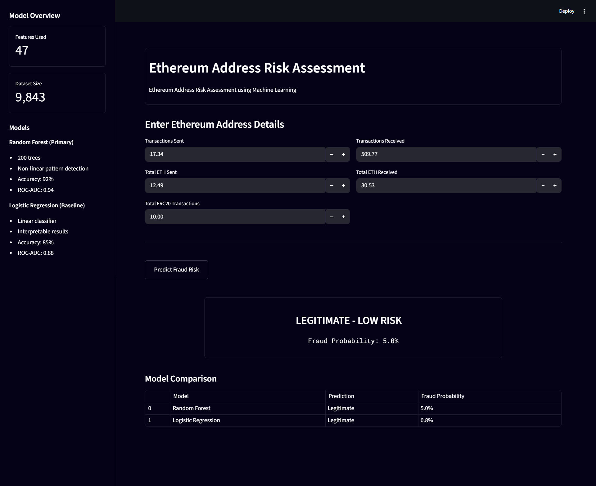

# Ethereum Address Risk Assessment

𝙃𝙖𝙫𝙚 𝙮𝙤𝙪 𝙚𝙫𝙚𝙧 𝙬𝙤𝙣𝙙𝙚𝙧𝙚𝙙 𝙝𝙤𝙬 𝙩𝙧𝙪𝙨𝙩𝙬𝙤𝙧𝙩𝙝𝙮 𝙖 𝙥𝙖𝙧𝙩𝙞𝙘𝙪𝙡𝙖𝙧 𝙀𝙩𝙝𝙚𝙧𝙚𝙪𝙢 𝙖𝙙𝙙𝙧𝙚𝙨𝙨 𝙞𝙨? 𝙒𝙝𝙚𝙩𝙝𝙚𝙧 𝙞𝙩’𝙨 𝙡𝙚𝙜𝙞𝙩𝙞𝙢𝙖𝙩𝙚, 𝙤𝙧 𝙞𝙛 𝙞𝙩 𝙢𝙞𝙜𝙝𝙩 𝙗𝙚 𝙞𝙣𝙫𝙤𝙡𝙫𝙚𝙙 𝙞𝙣 𝙛𝙧𝙖𝙪𝙙𝙪𝙡𝙚𝙣𝙩 𝙖𝙘𝙩𝙞𝙫𝙞𝙩𝙮?

𝘔𝘢𝘯𝘶𝘢𝘭𝘭𝘺 𝘤𝘩𝘦𝘤𝘬𝘪𝘯𝘨 𝘵𝘩𝘦 𝘧𝘶𝘭𝘭 𝘩𝘪𝘴𝘵𝘰𝘳𝘺 𝘰𝘧 𝘦𝘷𝘦𝘳𝘺 𝘵𝘳𝘢𝘯𝘴𝘢𝘤𝘵𝘪𝘰𝘯 𝘤𝘢𝘯 𝘣𝘦 𝘰𝘷𝘦𝘳𝘸𝘩𝘦𝘭𝘮𝘪𝘯𝘨 𝘢𝘯𝘥 𝘵𝘪𝘮𝘦-𝘤𝘰𝘯𝘴𝘶𝘮𝘪𝘯𝘨. 𝘛𝘩𝘢𝘵’𝘴 𝘸𝘩𝘦𝘳𝘦 𝘮𝘢𝘤𝘩𝘪𝘯𝘦 𝘭𝘦𝘢𝘳𝘯𝘪𝘯𝘨 𝘤𝘰𝘮𝘦𝘴 𝘪𝘯 𝘵𝘰 𝘩𝘦𝘭𝘱. 𝘐’𝘷𝘦 𝘥𝘦𝘷𝘦𝘭𝘰𝘱𝘦𝘥 𝘢 𝘱𝘭𝘢𝘵𝘧𝘰𝘳𝘮 𝘵𝘩𝘢𝘵 𝘮𝘢𝘬𝘦𝘴 𝘪𝘵 𝘦𝘢𝘴𝘺 𝘵𝘰 𝘢𝘴𝘴𝘦𝘴𝘴 𝘵𝘩𝘦 𝘭𝘦𝘨𝘪𝘵𝘪𝘮𝘢𝘤𝘺 𝘰𝘧 𝘢𝘯 𝘢𝘥𝘥𝘳𝘦𝘴𝘴.

𝗧𝗵𝗲 𝗽𝗹𝗮𝘁𝗳𝗼𝗿𝗺 𝘂𝘀𝗲𝘀 𝘁𝘄𝗼 𝗺𝗼𝗱𝗲𝗹𝘀:
Random Forest as the primary model and Logistic Regression as a baseline. Both models analyze transaction patterns and provide a percentage score that represents the probability of fraud, giving you a clear picture of how safe an address is.

This platform leverages Python libraries, including Streamlit for the interactive interface, Pandas and NumPy for data handling, and Pickle to load the trained machine learning models.

